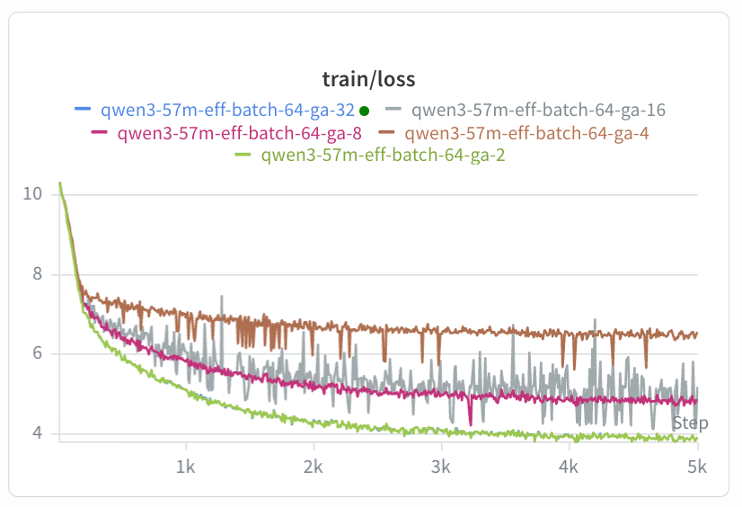

# `torch.compile` + CUDA prefetch-stream race

A subtle interaction between `torch.compile` and the standard "async H2D copy on a side CUDA stream" data-prefetch pattern caused our pretraining runs at certain `(batch_size, gradient_accumulation_steps)` configurations to systematically converge to worse loss basins. This document records what the bug looked like, how we tracked it down, the root cause, and the one-line fix.

**TL;DR**: The trainer prefetched the next mini-batch on a side CUDA stream with `non_blocking=True`, then `wait_stream`'d before consuming it. With `torch.compile`, the compiled graph schedules launches more aggressively than eager mode, opening a window in which the **caching allocator can free the input tensor's storage before the compiled graph finishes reading it** — because `wait_stream` only orders kernels, not allocator lifetimes. The fix is to also call `tensor.record_stream(current_stream())` after the wait, so the allocator knows the consumer stream is using the tensor.

---

## Background

**H2D copy** — moving a tensor from CPU (host) to GPU (device) memory:
```python
x = x_cpu.to("cuda", non_blocking=True)   # the H2D copy
```
`non_blocking=True` enqueues the copy on the GPU and returns immediately, so it can overlap with compute.

**CUDA streams (intuition).** Think of the GPU as a chef cooking meals (training steps) and the data as ingredients in a fridge (CPU RAM). Without a prefetch stream, the chef has to walk to the fridge, come back, cook, walk again — kitchen idle while walking. With a prefetch stream, you hire a **helper** who fetches the *next* batch's ingredients while the chef cooks the *current* batch. As long as the chef **waits** for the helper before starting, this is faster. The bug, in this analogy: the chef is correctly told to wait for delivery, but no one tells the kitchen manager (the allocator) that the chef is still using the current ingredients — so the manager hands that counter slot back to the helper, who plops the next batch on top of food the chef hasn't finished yet.

**CUDA streams (precise).** A stream is a queue the GPU executes in order; different streams can run concurrently. The trainer uses two: the **default stream** for compute, and a **prefetch stream** carrying H2D copies of the next batch alongside the current batch's compute. Two sync primitives matter, and they cover *different* concerns:

| Call | What it orders |
|---|---|
| `consumer.wait_stream(producer)` | the next *kernel* on `consumer` waits for `producer`'s queue |
| `tensor.record_stream(consumer)` | the *allocator* waits before reusing `tensor`'s storage |

Our bug came from having only the first.

**`torch.compile` / Inductor** — `torch.compile(model)` is the front door; **Inductor** is the back end that lowers ops into fused Triton + cuBLAS kernels and schedules them. Net effect vs eager: instead of issuing one launch per Python op as it goes, Inductor enqueues a whole forward (or forward+backward) worth of launches in one shot, possibly reordered. That widens the gap between "Python returns from `model(x)`" and "the GPU actually reads `x`'s bytes" — and that widened gap is exactly where the race lives.

**CUDA caching allocator** — GPU memory is owned by PyTorch's [caching allocator](https://zdevito.github.io/2022/08/04/cuda-caching-allocator.html); when the last Python reference to a tensor drops, its storage may be reused for the next allocation. The allocator decides "is this storage free yet?" by tracking the streams it knows about. `wait_stream` doesn't put the consumer stream on the allocator's radar; only `record_stream` does. So with only `wait_stream`, the allocator marks `x`'s storage free as soon as the *prefetch* stream finishes the H2D copy — while default-stream kernels are still about to read `x` — and the next H2D of `x_next` happily overwrites `x`'s slot. In eager mode the timing usually saves you (some default-stream kernels have already started by then); under compile the window stretches and the race fires.

---

## 1. The symptom

We were sweeping gradient-accumulation configurations at fixed effective batch (`eff_batch = batch_size × gradient_accumulation_steps = 64`) on a Qwen3-57M model and saw a striking non-monotonic divergence:



The brown curve is `(b=16, GA=4)` — clearly stuck around train loss ~6.5 while every other configuration converges below 5. Final val_loss numbers at step 5000:

| GA | batch_size | val_loss @ step 5000 |
|----|------------|----------------------|
|  1 | 64 | (OOM) |
|  2 | 32 | 3.79 |
|  4 | 16 | **4.68** ← worst |
|  8 |  8 | 4.02 |
| 16 |  4 | 3.96 |
| 32 |  2 | 3.58 |
| 64 |  1 | 3.15 |

`(b=16, GA=4)` was anomalously bad. Reruns (same config, same seed) reproduced the gap exactly. fp32 also reproduced it. A different seed (`seed=43`) reproduced it. So it wasn't randomness or precision.

A per-layer gradient-norm analysis showed the signature of vanishing gradients in early transformer blocks: by step 200, `block 0` parameters in the BAD run had gradients ~6× smaller than in the GOOD `(b=32, GA=2)` run, while `block 7` was only ~2× smaller. Classic "gradient damping through depth" — the model couldn't push useful signal back to the input layers.

## 2. Ablations that pointed at the cause

A single training-step gradient comparison (same initial weights, same input) showed cosine similarity 0.99999 between configurations — math is identical. So the bug wasn't a wrong gradient formula. It was a *trajectory* effect compounding from tiny per-step differences.

Then the decisive ablation: `TORCHDYNAMO_DISABLE=1` on the bad config recovered the good trajectory exactly:

| step | BAD (compiled) | GOOD (eager, same seed/data) |
|------|----------------|-------------------------------|
| 100  | 8.913 | 8.788 |
| 200  | 7.445 | 7.145 |
| 300  | 7.082 | 6.549 |
| 400  | 6.762 | 6.179 |

So `torch.compile` was involved. But **what about `torch.compile`** specifically? More ablations:

| Configuration | val_loss @ step 400 | Result |
|---|---|---|
| compiled, default | 6.76 | BAD baseline |
| compiled, `num_workers=0` | ~6.76 | DataLoader workers not the cause |
| compiled, prefetch_stream removed | 6.16 | **fixes it** |
| eager (`TORCHDYNAMO_DISABLE=1`) | 6.18 | also fixes it |

So the bug requires **both** `torch.compile` AND the side-stream H2D-prefetch pattern. Either alone is fine.

## 3. Root cause

The trainer's prefetch pattern, before the fix:

```python
prefetch_stream = torch.cuda.Stream()

# enqueue async H2D copy on prefetch_stream
with torch.cuda.stream(prefetch_stream):
    x = x_cpu.to(device, non_blocking=True)
    y = y_cpu.to(device, non_blocking=True)

# in the GA loop:
torch.cuda.current_stream().wait_stream(prefetch_stream)   # default stream waits
with torch.amp.autocast(...):
    logits = compiled_model(x)                              # consume on default stream
```

`wait_stream` correctly inserts a CUDA event so that the **default stream's next kernel** waits for the prefetch stream's H2D to finish. Kernel ordering is fine.

But PyTorch's caching allocator tracks tensor lifetimes **per stream**. When `x` was created inside `with torch.cuda.stream(prefetch_stream)`, the allocator records "this storage is live on prefetch_stream." Once the only enqueued op on prefetch_stream (the H2D copy) completes, the allocator considers `x`'s storage **free for reuse** — *even though the default stream is still consuming it*.

In eager mode this is usually safe by accident: the Python interpreter immediately enqueues the next-batch H2D copy and the model's first forward kernels onto their respective streams, and by the time the next allocation needs storage, the consuming kernels have already started. With `torch.compile`, the compiled graph is submitted as a larger atomic unit and Inductor schedules launches more aggressively, **widening the window** between "graph submitted" and "graph actually reads x." During that window, the allocator can hand `x`'s storage to the next H2D copy of the *next* batch — which then writes new data into the same memory the model is about to read.

The result isn't a hard crash (most of the time): the model reads a mix of correct and partially-overwritten input, computes a slightly biased gradient, and trains. After thousands of steps in the same mostly-correct-but-slightly-wrong direction, it lands in a meaningfully worse basin.

We confirmed the corruption directly by attempting the [CUDA Semantics docs](https://docs.pytorch.org/docs/stable/notes/cuda.html)'s alternative pattern of running the compiled model itself on the prefetch stream — which immediately tripped a device-side assertion `Assertion 'index out of bounds: 0 <= tmp12 < 50304' failed` on the embedding lookup, because the model was reading uninitialized GPU memory containing token-id-shaped garbage.

### The relevant PyTorch / CUDA documentation

The behavior we hit is documented, just easy to miss:

- **[CUDA Semantics — "Use of multiple streams"](https://docs.pytorch.org/docs/stable/notes/cuda.html)**:
  > "The memory allocator [...] must be aware of the streams that use a tensor for this to work. Without that knowledge, it would be quite likely to encounter use-after-free errors. [...] To use a tensor on a stream different from the one where it was created, you need to use `Tensor.record_stream(stream)`."

- **[`torch.Tensor.record_stream`](https://docs.pytorch.org/docs/stable/generated/torch.Tensor.record_stream.html)**:
  > "Marks the tensor as having been used by this stream. When the tensor is deallocated, ensure the tensor memory is not reused for another tensor until all work queued on `stream` at the time of deallocation is complete."

- **["A guide to PyTorch's CUDA Caching Allocator" by Zach DeVito](https://zdevito.github.io/2022/08/04/cuda-caching-allocator.html)**:
  > "There are no [stream-ordering] guarantees between streams, so extra care has to happen when a tensor `A` is allocated on one stream `creator` but used on another stream `user`. [...] The user has to call `A.record_stream(user)` to inform the allocator about this use."

The canonical PyTorch example, including both calls:

```python
s = torch.cuda.Stream()
A = torch.empty(...)                  # created on default stream
s.wait_stream(torch.cuda.default_stream())   # ordering for kernels
with torch.cuda.stream(s):
    B = some_op(A)
A.record_stream(s)                    # ordering for memory reuse
```

`wait_stream` and `record_stream` are a **pair**: the first orders kernel execution, the second orders memory lifetime. Using only the first works in eager mode much of the time but breaks under `torch.compile` because compile widens the race window.

## 4. The fix

A two-line change in `src/training/trainer.py`:

```python
for micro_step in range(cfg.gradient_accumulation_steps):
    if prefetch_stream is not None:
        torch.cuda.current_stream().wait_stream(prefetch_stream)
        x.record_stream(torch.cuda.current_stream())   # <-- ADDED
        y.record_stream(torch.cuda.current_stream())   # <-- ADDED
    ...
```

Verification on the original failing config (Qwen3-57M, b=16, GA=4, 400 steps):

| step | BEFORE fix (compiled) | AFTER fix (compiled + record_stream) | EAGER (TORCHDYNAMO_DISABLE=1) |
|---|---|---|---|
| 100 | 8.913 | **8.788** | 8.788 |
| 200 | 7.445 | **7.139** | 7.145 |
| 300 | 7.082 | **6.536** | 6.549 |
| 400 | 6.762 | **6.164** | 6.179 |

The fix recovers the GOOD trajectory to within ~0.01 nats of the eager-mode baseline, with **no throughput regression** (~321k tok/s after the fix vs ~318k before — the H2D/compute overlap is preserved because we keep the prefetch stream).

## 5. Reproducing the bug and fix yourself

The standalone repro script is `docs/torch_compile_prefetch_bug/repro.py`. It builds a Qwen3-57M-style model from scratch (no project dependencies on `src/`), loads `data/train.bin` if present (synthetic fallback otherwise), and trains for N steps in three modes back-to-back so you can see the gap directly.

### Reproducing the BUG

```bash
# Side-by-side comparison: BAD vs GOOD vs FIX, identical seed/data/model
uv run python docs/torch_compile_prefetch_bug/repro.py --steps 500 --mode all
```

Expected output (final summary):

```
Mean loss over second half (lower = better):
        prefetch: 6.394 (gap vs no-prefetch: +0.106)    ← BAD
     no-prefetch: 6.289 (baseline)                       ← GOOD
   record-stream: 6.290 (gap vs no-prefetch: +0.002)    ← FIX, matches GOOD
```

The standalone gap (~+0.1 nats over 500 steps) is smaller than the full-project gap (~+0.6 nats at step 400, ~+2.6 nats at step 5000) — but it is **consistently positive**, **grows monotonically with steps**, and **closes to zero with `record_stream`**. That's enough to show the mechanism. The full-project amplification appears to come from the optimization landscape interacting with the bias differently for our specific data distribution; the fundamental cause is the same.

### Reproducing the FIX in production code

```bash
# Should produce eval losses 8.79 / 7.14 / 6.55 / 6.18 — matching the GOOD trajectory.
uv run python scripts/train.py \
    --config experiments/grad_accum/qwen3_57m_eff_batch_64_ga_4.yaml \
    --no-wandb --debug.max_steps=400
grep "val_loss" /tmp/<output_log>   # or read directly from the run
```

Before the fix this produced 8.91 / 7.44 / 7.08 / 6.76. After the fix it matches the eager baseline.

To verify by reverting the fix:

```bash
git diff src/training/trainer.py     # inspect the two record_stream lines
git stash                             # remove the fix
uv run python scripts/train.py --config experiments/grad_accum/qwen3_57m_eff_batch_64_ga_4.yaml --no-wandb --debug.max_steps=400
# eval at step 400 should be ~6.76 (BAD)
git stash pop                         # restore the fix
```

## 6. Why we never noticed before

`wait_stream`-only is the pattern most PyTorch tutorials show. Several factors made the bug particularly hard to attribute:

- It only manifested for *some* `(batch, GA)` shapes — not all. We initially suspected an Inductor codegen bug specific to a shape, not a general lifetime bug, because some shapes "worked".
- It manifested *consistently* across reruns and seeds, so it didn't look like a stochastic race.
- The gradient differences were tiny per step (cosine sim 0.99999) so the gradient-equivalence test we ran first looked like a clean bill of health.
- The damage compounds slowly through depth and over thousands of steps, presenting as a gradual loss-curve drift rather than an obvious wrongness.

The chain that finally broke the case was: rule out math/seed/precision with the gradient comparison → confirm `torch.compile` is involved with `TORCHDYNAMO_DISABLE=1` → ablate components inside the trainer until removing the prefetch stream alone fixed it → realize the missing piece is `record_stream`.

## 7. Related references

- [PyTorch CUDA Semantics — "Use of multiple streams"](https://docs.pytorch.org/docs/stable/notes/cuda.html) — official doc on stream/allocator interaction.
- [`torch.Tensor.record_stream`](https://docs.pytorch.org/docs/stable/generated/torch.Tensor.record_stream.html) — exact contract of the call we added.
- [Zach DeVito, "A guide to PyTorch's CUDA Caching Allocator"](https://zdevito.github.io/2022/08/04/cuda-caching-allocator.html) — best deep-dive on the lifetime-tracking algorithm and why cross-stream usage needs explicit notification.
- [CUDA Streams, Events, and Synchronization (DeepWiki on pytorch/pytorch)](https://deepwiki.com/pytorch/pytorch/3.2.2-cuda-streams-events-and-synchronization) — overview of how PyTorch wraps CUDA streams.
- [`torch.compile` documentation](https://docs.pytorch.org/docs/stable/torch.compiler.html) — for context on Inductor-generated graphs.

## Files in this directory

- `README.md` — this document.
- `repro.py` — standalone reproducer, ~460 LOC, no project deps. See header for usage.
- `loss_curves.png` — W&B screenshot of train loss across the `(batch, GA)` sweep at `eff_batch=64`; the original symptom that started the investigation.

Sources:
- [CUDA semantics — PyTorch docs](https://docs.pytorch.org/docs/stable/notes/cuda.html)
- [torch.Tensor.record_stream — PyTorch docs](https://docs.pytorch.org/docs/stable/generated/torch.Tensor.record_stream.html)
- [A guide to PyTorch's CUDA Caching Allocator — Zach DeVito](https://zdevito.github.io/2022/08/04/cuda-caching-allocator.html)
- [CUDA Streams, Events, and Synchronization — DeepWiki](https://deepwiki.com/pytorch/pytorch/3.2.2-cuda-streams-events-and-synchronization)
