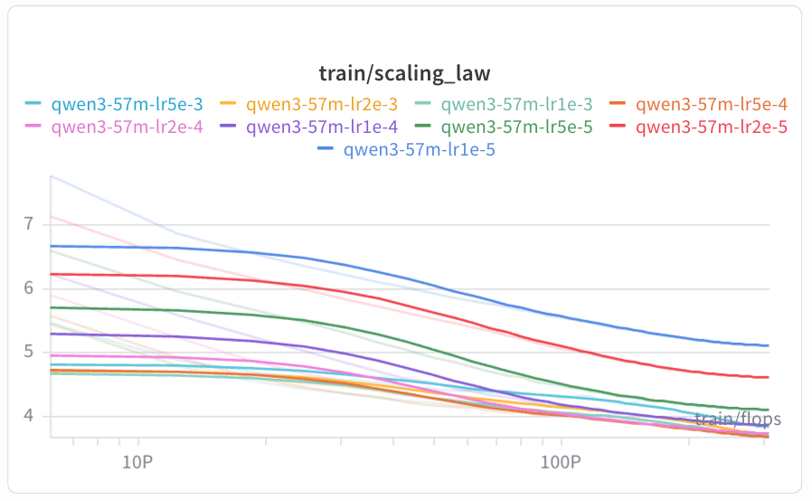
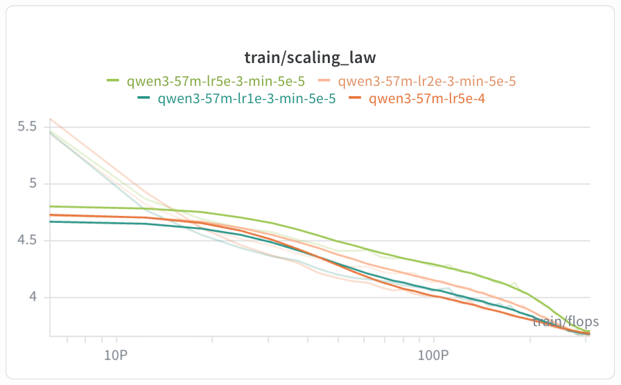
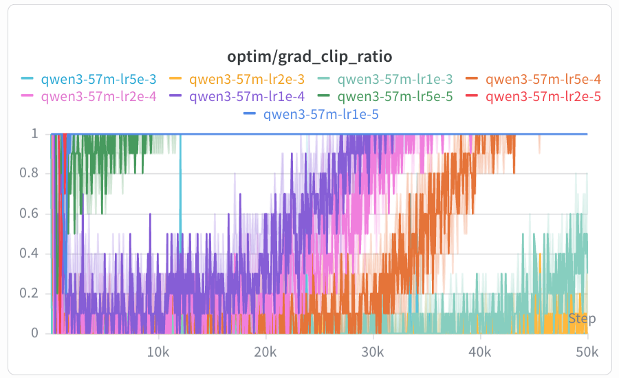

# Learning Rate Sweep

Sweep learning rate on Qwen3 57M to find the optimal LR for this model size and token budget.

## Hypothesis

There is a compute-optimal learning rate for a given model size and training duration. Too small → slow convergence and underfitting within the step budget; too large → instability and divergence.

## Setup

| Config | LR | min_lr |
|---|---|---|
| qwen3_57m_lr1e-5 | 1e-5 | 1e-6 |
| qwen3_57m_lr2e-5 | 2e-5 | 2e-6 |
| qwen3_57m_lr5e-5 | 5e-5 | 5e-6 |
| qwen3_57m_lr1e-4 | 1e-4 | 1e-5 |
| qwen3_57m_lr2e-4 | 2e-4 | 2e-5 |
| qwen3_57m_lr5e-4 | 5e-4 | 5e-5 |
| qwen3_57m_lr1e-3 | 1e-3 | 1e-4 |

All runs share: Qwen3 57M (d_model=512, layers=8, heads=8, kv_heads=4), seq_len=1024, batch_size=4, grad_accum=8 (effective batch=32), 50K steps, cosine schedule with 1K warmup steps, bf16, OpenWebText.

## Run

```bash
nohup bash experiments/lr/run.sh > logs/lr.log 2>&1 &
```

## Results



| LR | Final Val Loss |
|---|---|
| 1e-5 | 5.1011 |
| 2e-5 | 4.6066 |
| 5e-5 | 4.1001 |
| 1e-4 | 3.8586 |
| 2e-4 | 3.7308 |
| 5e-4 | 3.6717 |
| 1e-3 | 3.6847 |
| 2e-3 | 3.7088 |
| 5e-3 | 3.8303 |

### Extended runs (higher LR + min_lr=5e-5)



| Config | Final Val Loss |
|---|---|
| lr5e-4, min_lr=5e-5 | 3.6717 |
| lr1e-3, min_lr=5e-5 | 3.6729 |
| lr2e-3, min_lr=5e-5 | 3.6552 |
| lr5e-3, min_lr=5e-5 | 3.6695 |

## Notes

- `grad_clip_ratio` starts at 0 early in training and slowly increases to 1. This is normal — gradients grow as the model learns sharper features, eventually exceeding the clip threshold on every step. Clipping then acts as a constant gradient normalizer. Only concerning if the transition is sudden (loss spike) or if loss keeps rising despite clipping.

    

- LR sweep shortcut: run all candidates for 500 steps first. If a higher LR already loses to a lower LR at 500 steps, filter it out. Run the surviving candidates to 5K steps, filter again, then run the rest to 10K steps. This saves compute by eliminating clearly suboptimal LRs early.
