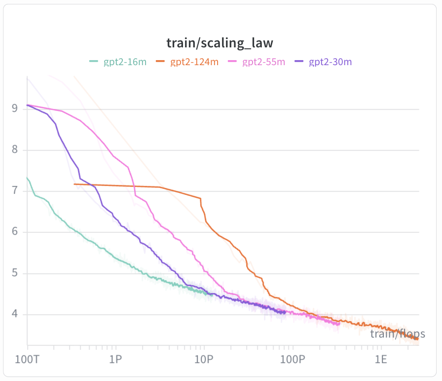

# Scaling Law

Reproduce IsoLoss curves from Kaplan et al. — plot training loss vs compute (FLOPs) across model sizes to find the compute-optimal frontier.

## Hypothesis

For a fixed compute budget, there exists an optimal (model size, tokens) pair. Larger models are more sample-efficient but cost more FLOPs per token.

## Models

### GPT-2

Learned positional embeddings + LayerNorm + GELU FFN (intermediate_size=4×d_model) + MHA (full KV heads) + bias in all linear layers.

| Config | d_model | layers | heads | ~Params | LR |
|---|---|---|---|---|---|
| gpt2_16m | 256 | 4 | 4 | ~16M | 1e-3 |
| gpt2_30m | 384 | 6 | 6 | ~30M | 8e-4 |
| gpt2_55m | 512 | 8 | 8 | ~51M | 6e-4 |
| gpt2_124m | 768 | 12 | 12 | ~124M | 6e-4 |

### Qwen3

RoPE + RMSNorm + SwiGLU (intermediate_size=4×d_model) + GQA (n_kv_heads=n_heads/2) + qk_norm.
Larger params than GPT-2 counterparts at same depth/width due to SwiGLU's extra gate matrix.

| Config | d_model | layers | heads | kv_heads | ~Params | LR |
|---|---|---|---|---|---|---|
| qwen3_17m | 256 | 4 | 4 | 2 | ~17M | 1e-3 |
| qwen3_33m | 384 | 6 | 6 | 3 | ~33M | 8e-4 |
| qwen3_57m | 512 | 8 | 8 | 4 | ~57M | 6e-4 |
| qwen3_145m | 768 | 12 | 12 | 6 | ~145M | 6e-4 |

All share: same tokenizer (50K BPE), same data (OpenWebText), same seq_len (1024).

## FLOPs

Logged to W&B as `train/flops` using `C = 6 * N_non_embedding * tokens`.

## Run

```bash
# GPT-2
nohup bash experiments/scaling_law/gpt2/run.sh > scaling_law_gpt2.log 2>&1 &

# Qwen3
nohup bash experiments/scaling_law/qwen3/run.sh > scaling_law_qwen3.log 2>&1 &
```

## Plot

In W&B: custom chart with X=`train/flops` (log scale), Y=`train/loss` (log scale), grouped by run.

## Results

| FLOPs | Loss |
|---|---|
| 1e16 | 4.57 |
| 2e16 | 4.39 |
| 5e16 | 4.19 |
| 1e17 | 4.05 |
| 2e17 | 3.87 |
| 5e17 | 3.77 |
| 1e18 | 3.71 |


