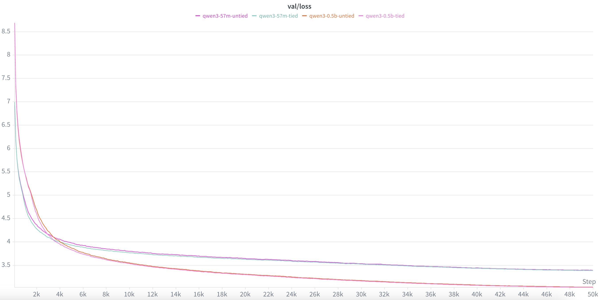
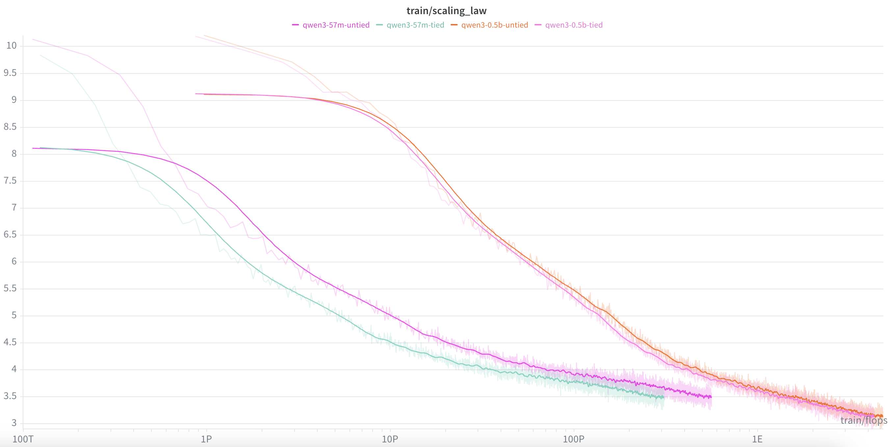
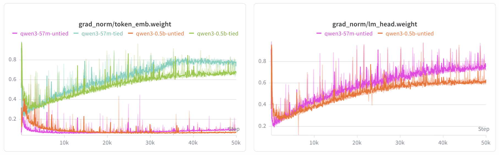

# Tie Word Embeddings

Test the effect of tying `lm_head.weight` to `token_emb.weight` on pretraining quality using the Qwen3 architecture at two scales.

## Hypothesis

Weight tying reduces parameter count and enforces that input and output token representations share the same space, acting as a regularizer. However, it also constrains the model — the input embedding must simultaneously serve as a good token lookup table and a good output projection. Untied weights give the model more expressivity at the cost of extra parameters. The effect is expected to be more visible at larger scale where the model has capacity to benefit from separate representations.

## Setup

| Config | tie_word_embeddings | Approx params |
|---|---|---|
| qwen3_57m_tied | true | ~57M |
| qwen3_57m_untied | false | ~83M (+26M for separate lm_head) |
| qwen3_0.5b_tied | true | ~0.5B |
| qwen3_0.5b_untied | false | ~0.55B (+51M for separate lm_head) |

**57M runs**: Qwen3 (d_model=512, layers=8, heads=8, kv_heads=4, qk_norm=true), seq_len=1024, batch_size=16, grad_accum=16, 5K steps (~1.3B tokens), lr=6e-4, warmup=200 steps, min_lr=6e-5, bf16, OpenWebText.

**0.5B runs**: Qwen3 (d_model=1024, layers=28, heads=16, kv_heads=8, qk_norm=true), seq_len=1024, batch_size=16, grad_accum=16, 50K steps (~13B tokens), lr=2e-4, warmup=1500 steps, min_lr=2e-5, bf16, OpenWebText.

## Run

```bash
# All runs (57M + 0.5B)
nohup bash experiments/tie_word_embd/run.sh > logs/tie_word_embd.log 2>&1 &

# 57M only
uv run python scripts/train.py --config experiments/tie_word_embd/qwen3_57m_tied.yaml
uv run python scripts/train.py --config experiments/tie_word_embd/qwen3_57m_untied.yaml

# 0.5B only
uv run python scripts/train.py --config experiments/tie_word_embd/qwen3_0.5b_tied.yaml
uv run python scripts/train.py --config experiments/tie_word_embd/qwen3_0.5b_untied.yaml
```

## Results

### Val Loss



| Model | tie_word_embeddings | Val Loss |
|---|---|---|
| qwen3_57m | true | 3.3862|
| qwen3_57m | false | 3.391|
| qwen3_0.5b | true | 3.0237|
| qwen3_0.5b | false | 3.0295|

### FLOPs / Val Loss



| Model | tie_word_embeddings | FLOPs | Val Loss |
|---|---|---|---|
| qwen3_57m | true | 100P | 3.7472 |
| qwen3_57m | false | 100P | 3.8832 |
| qwen3_0.5b | true | 1E | 3.6383 |
| qwen3_0.5b | false | 1E | 3.7125 |

### Gradient Norm



**Observation (untied runs):** `token_emb` gradient norm is consistently **small**, while `lm_head` gradient norm is consistently **large**

## Notes

### Idea and Assumptions

Both matrices have the same shape `[vocab_size, d_model]` and live in the same space. Row `v` of `W_emb` is the vector injected into the transformer when token `v` is an **input**; row `v` of `W_out` is the vector dotted with the final hidden state to produce the **logit** for token `v`. Two sides of the same coin — "the d-dim representation of token v" viewed from either end of the network.

**Tying** (Press & Wolf, 2017) assumes one vector per token is enough: input and output representations should live in the same geometry. Semantically close tokens ("king"/"queen") want close rows on both sides, and training already pushes the two matrices toward similar geometry. Tying hard-codes that prior and removes `V × d` redundant parameters.

**Untying** assumes the two roles are related but not identical: `W_emb[v]` = "what does this token contribute downstream?", `W_out[v]` = "in what hidden states is this token the right answer?". Separate parameters let `W_out` specialize as a classifier head instead of also serving as a good input lookup. Tying trades expressivity for regularization; untying pays expressivity in parameters.

Empirically both curves are close (gap <0.01 at 57M and 0.5B); tied converges slightly faster early — tying acts as a useful inductive bias without bounding long-run loss much.

### Math

**Forward.** With `x_i = W_emb[input_token_i]`, `h_i = f(x_0, …, x_i)`, and target `t_i`:
- `logits_{i,v} = h_i · W_out[v]`
- `L = −Σ_i log softmax(logits_i)[t_i]`

When tied (`W_emb = W_out = W`), the logit for `v` is literally an inner product between the hidden state and token `v`'s representation — a **similarity score**. The same vector that represents `v` as input also measures "how much does this hidden state look like `v`?" as output.

**Backward.** With `dL/d_logit_{i,v} = p_{i,v} − 1[v == t_i]`:

- **`W_out` — dense across rows, weak per cell:**
  ```
  dL/dW_out[v] = Σ_i (p_{i,v} − 1[v == t_i]) · h_i
  ```
  Every row gets contributions from every position, but `p_{i,v}` is near 0 for most `(i, v)`. Strong gradient only on the target row (and a few confusable alternatives).

- **`W_emb` — sparse across rows, strong per hit:**
  ```
  dL/dW_emb[v] = Σ_{i: input_token_i == v} dL/dx_i
  ```
  Only rows for tokens that appeared in the input batch receive any gradient, but those rows get the full upstream gradient.

When tied, the shared row `v` sums both: `dL/dW[v] = output-side + input-side`. For **rare tokens** each contribution is individually weak (rare as target → weak output signal; rare as input → weak input signal), so summing is roughly a 2× gradient amplification for exactly the rows that need it most. Tying is not just a parameter saving — it's an **optimization aid** for the long tail.

### Scale-dependent verdict — tie wins small, untie wins large

**Small (<~2B params): tie wins.**

- *Parameter fraction.* `V × d` is a large share at small scale. Our 57M Qwen3 (`V=50K`, `d=512`) has ~26M embedding = ~45% of total; untying nearly doubles that block for −0.005 in loss. Strictly worse on params/loss and flops/loss.
- *Gradient starvation.* At small token budgets, rare `W_out` rows barely train — they're rarely the target. Tying lends them the input-side gradient and keeps them alive.
- *Inductive bias.* When capacity is scarce, forcing input/output geometries to coincide is a useful prior; the model spends capacity on the transformer body instead of learning two similar maps.

In reality, **Qwen3 ≤1.7B, Gemma-2B, LLaMA-3.2-1B, GPT-2** all tie.

**Large (≳2B params): untie wins.** Same three forces reverse:

- *Param fraction collapses.* At 7B (`d=4096`), a second `V × d` ≈ 3% of the model. Cost negligible, capacity non-trivial.
- *Starvation disappears.* With hundreds of B to trillions of tokens, even rare `W_out` rows see the target enough to train on their own.
- *Specialization pays.* With spare capacity, letting `W_out` become a focused classifier and `W_emb` a focused input lookup beats forcing them equal.

In reality, **GPT-3, LLaMA-2/3 7B+, Qwen3 >1.7B, Mistral, Gemma-7B+** all untie.

**Summary.** Tying vs untying is a trade-off between gradient amplification on rare rows (tying) and head specialization (untying), mediated by the parameter-fraction of `V × d`. Small scale favors tying on every axis; past ~2B it flips.

